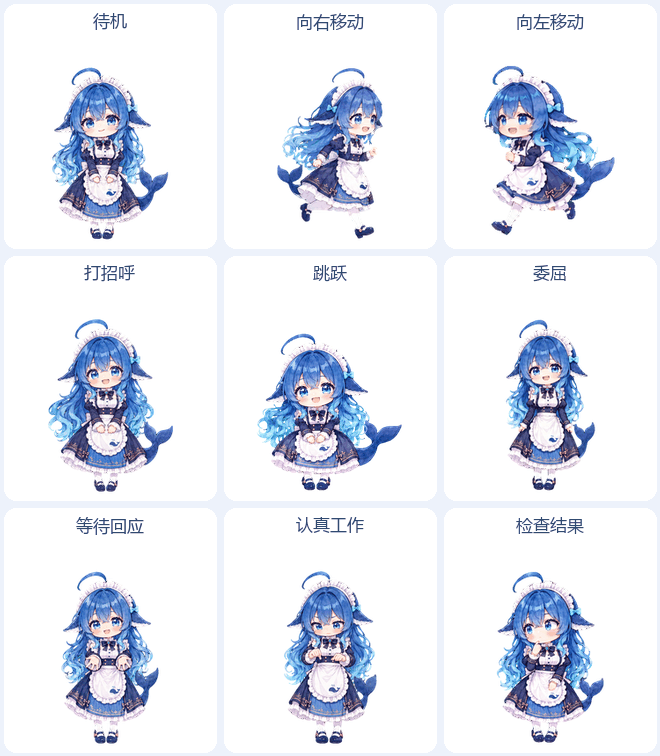

# DeepSeek-pet

大肥鱼——DeepSeek鲸鱼娘社区同人Codex桌面宠物。

保留蓝色渐变长发、蓝白鲸鳍、弧形呆毛、浅蓝发结、宝石领结、金扣女仆装、鲸鱼围裙和分叉鲸尾，采用圆脸Q版造型。包含9种动作、57帧，背景透明。细小纹饰按桌面显示尺寸做了适配。



## 安装

1. 点击仓库页面的**Code → Download ZIP**，下载并解压。
2. 将仓库中`pets/dafeiyu`整个文件夹复制到Codex的`pets`目录。默认位置如下：

   | 系统 | 宠物文件夹位置 |
   | --- | --- |
   | Windows | `%USERPROFILE%\.codex\pets\dafeiyu\` |
   | macOS / Linux | `~/.codex/pets/dafeiyu/` |

   如果设置了`CODEX_HOME`，请放入该目录下的`pets/dafeiyu/`。

3. 在Codex宠物选择器中选择**大肥鱼**。若列表未刷新，重新打开Codex后查看。

安装后的核心文件应为：

```text
~/.codex/pets/dafeiyu/
├── pet.json
└── spritesheet.webp
```

需要支持自定义宠物的Codex版本。复制时保持文件名和目录结构不变；已有同名宠物时，请先备份原文件。

## 动作

| 状态 | 表现 | 帧数 |
| --- | --- | ---: |
| 待机 | 呼吸、眨眼和轻微摆动 | 6 |
| 向右移动 | 向右迈步，头发和裙摆随动 | 8 |
| 向左移动 | 向左迈步，保留原侧发饰 | 8 |
| 打招呼 | 抬手挥动后收回 | 4 |
| 跳跃 | 蓄力、起跳、腾空、下降和落地 | 5 |
| 委屈 | 皱眉、红脸、含泪和稍稍恢复 | 8 |
| 等待回应 | 双手掌心向上、歪头和眨眼 | 6 |
| 认真工作 | 专注眼神与原地手部动作 | 6 |
| 检查结果 | 托腮、转眼、倾头和眨眼 | 6 |

## 预览与文件

下载仓库后，打开[`preview/index.html`](preview/index.html)即可切换九种动作、暂停播放及切换深浅背景。

```text
pets/dafeiyu/   宠物安装文件
previews/      动画演示、静态预览和全部动作帧
preview/       交互预览页
NOTICE.md      形象来源与原作署名
LICENSE        使用协议
```

图集为1536×1872像素，固定8列9行，每格192×208像素；未使用的单元格保持透明。[查看全部动作帧](previews/contact-sheet.png)。

## 来源与使用协议

鲸鱼娘形象原作：[上善无形](https://space.bilibili.com/4456176)。DeepSeek元素及女仆形象二次设计：[ZipZipPipe](https://space.bilibili.com/4168597)。来源说明见[NOTICE.md](NOTICE.md)。

本项目为社区同人，非DeepSeek或OpenAI官方项目。衍生角色图像采用[CC BY-NC-SA 4.0](https://creativecommons.org/licenses/by-nc-sa/4.0/deed.zh-hans)：保留署名、仅限非商业使用、以相同协议分享。原角色及参考作品的权利归各自权利人所有。
